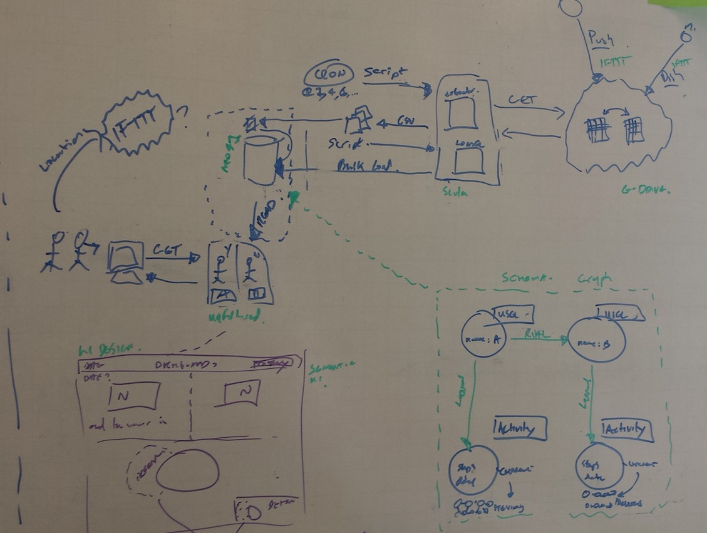

# fitbit-dashboard

Simple dashboard to display a personalised summary of fitbit activity.
Compares 2 related users data, revealing who achieved the most steps from the previous days activity.

### design

This is an early version, to be replaced with a more detailed one.

### Colophon

- sbt (build)
- scala (language)
- neo4j (db)
- Anorm Cypher (orm ... ish)
- unfiltered (hosting framework)
- scalate (web templating)
- semantic-ui (styling)

### breakdown

Consists of 3 sub projects

- extractor (pull fitbit data from an external csv, hosted on google drive)
- loader (load the csv data into neo4j backend)
- dashboard (web framework to render fitbit data from neo4j)

See the readme in each sub project for more detail on them.
Also there are some additionals bash scripts to tie it together, I use these on the deployment target.

### why

I'm jumping through more hoops here than I really need, only reason for this was to give me something  a bit more meaty to get my teeth into, for experimenting with some of scala's functional programming aspects. Also an excuse to play around with neo4j and cypher.

### usage

if there is really anyone out there that would want to run this themselves, you'll need a few pre-requistes:

- api access to a google drive spreadsheet with a bunch of columns (see the extractor readme)
- some mechanism to add data fitbit data to this csv - I've used the excellent IFTTT app with the following [recipe](https://ifttt.com/recipes/173925-add-your-fitbit-daily-activity-summaries-to-a-google-spreadsheet) 
- neo4j db (rest api exposed)
- most configuration is coded into the config.Config scala class

When all those prereqs sorted, its a case of running the scripts in following order

    ./scripts/runExtractor.sh
    ./scripts/runLoader.sh    
    ./scripts/runDashboard.sh

By default the frontend binds to locahost on port 8000 - http://localhost:8000/dashboard

It's a fair bit of setup, I can provide more detail if there is any interest.
